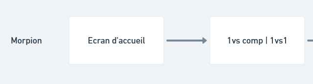

# Création d'un jeu du morpion en ligne
Pour vous familiariser avec Whimsical et la méthode de création d'une interface (Flowchart + Wireframe), vous allez commencer par une interface où les règles sont déjà bien établies.
Vous allez créer le jeu du morpion où le joueur peut jouer contre un adversaire à coté de lui ou contre la machine.
Vous devez faire le flowchart et le wireframe mobile de l'application, depuis l'écran d'accueil.

