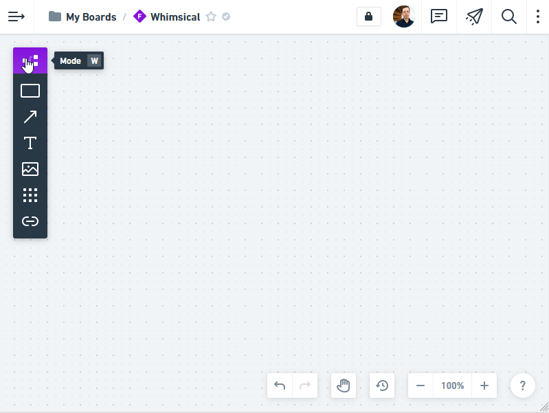
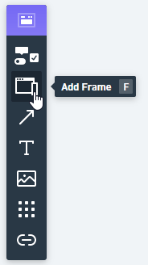
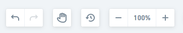

# Découverte de Whimsical
Whimsical est l'application en ligne que nous allons utiliser pour ce module. Elle va vous aider à créer des flowcharts et des wireframes au sein d'un même espace et le tout, avec une simplicité redoutable.

- [Découverte de Whimsical](#découverte-de-whimsical)
  - [Création du compte](#création-du-compte)
  - [Mode flowchart](#mode-flowchart)
    - [Ajouter une forme](#ajouter-une-forme)
    - [Ajouter un connecteur](#ajouter-un-connecteur)
  - [Mode Wireframe](#mode-wireframe)
    - [Ajouter un cadre de conception](#ajouter-un-cadre-de-conception)
    - [Ajouter un élément](#ajouter-un-élément)
    - [Personnaliser un élément](#personnaliser-un-élément)
      - [Ajouter une icône à un bouton](#ajouter-une-icône-à-un-bouton)
    - [Élément de formulaire](#élément-de-formulaire)
      - [Qu'est-ce qu'un state ?](#quest-ce-quun-state)
  - [Naviguer sur votre tableau](#naviguer-sur-votre-tableau)

## Création du compte
Allez sur [whimsical.com](https://whimsical.com) et créez votre compte. **Pour des question de RGPD, privilégiez votre adresse mail universitaire si possible.** Si vous optez pour votre adresse personnel, Whimsical offre la possibilité de supprimer son compte très simplement en allant dans les paramètres.
Un compte gratuit vous donne droit à 4 boards (tableaux) pour vos projets, ce qui est suffisant pour faire le module.

## Mode flowchart

Cliquez sur *Mode*, puis choisissez *Flowchart*.
### Ajouter une forme
\
En dessous du choix du mode, vous avez un rectangle qui vous servira à créer les étapes de l'interface que vous devez produire.
\
Ensuite vous pouvez personnaliser ou ajouter une étape dans la directions de votre choix.
\
### Ajouter un connecteur
Dans la barre d'outils, en dessous de "Add a shape", vous avez le bouton avec une flêche "add a connector". C'est ce qui vous servira à relier une étape éloignée d'une autre. Pour ça, il vous suffit de déssiner le parcours de la flêche et l'interface devrait comprendre ce que vous souhaitez faire
\
C'est tout ce qu'il y a à savoir sur le mode *flowchart*. Libre à vous d'expérimenter et de vous avanturez hors des sentiers battus.

## Mode Wireframe
\
Cliquez sur *Mode*, puis choisissez *Wireframe*. La barre d'outils devrait avoir la même apparence que sur l'image du dessus.
### Ajouter un cadre de conception
\
Le premier outil qui nous intéresse est *Add a frame*. Choisir un cadre permet de mieux distinguer si vous concevez une interface pour mobile ou ordinateur. Prennez ce dont vous avez besoin et validez.\
\
Ici, j'ai pris une fenêtre de navigateur de bureau. Vous pouvez la personnaliser et la renommer pour mieux vous reperez dans le cas où vous en mettez plusieurs sur le même tableau.
### Ajouter un élément
Dans son mode wireframe, Whimsical intègre une bibliothèque d'éléments d'interface.\
\
Cliquez sur *Add an element* puis choisissez parmis la liste comme ci-dessous.\
\
### Personnaliser un élément
\
J'ai choisi d'intégrer un bouton et comme sur l'image du dessus, vous devriez avoir le menu de personnalisation qui s'affiche.
#### Ajouter une icône à un bouton
\
Cliquez sur l'icône avec la grille de petits carrés et la liste des icônes s'affiche. Vous pouvez placez l'icône à gauche où à droite en cliquant sur les boutons *L* ou *R* qui sont situé en bas du menu :\
\
### Élément de formulaire
Par exemple, pour un élément de type *checkbox*\
\
Vous voyez normalement une option *State* qui est reglé par défaut sur *normal*
#### Qu'est-ce qu'un state ?
Un state, c'est l'état dans lequel se trouve l'élément. Il peut être :
- Normal
- Selected quand l'utilisateur a coché cet item où qu'on a coché cette item par défaut
- Indeterminate, nous n'en aurez pas besoin
- Focused : c'est quand une personne utilise son clavier pour naviguer entre les éléments et que l'item est selectionner mais pas encore coché
- Error
- Disabled : L'item est desactivé. Par exemple, une option de livraison indisponible temporairement.

## Naviguer sur votre tableau
Pour naviguer rapidement sur votre tableau, vous avez cette barre d'outils en bas :\
\
- La flêche arrière revient en arrière dans l'historique de vos actions (Raccourci clavier : Control + Z)
- La flêche arrière revient en avant dans l'historique de vos actions (Raccourci clavier : Control + Shift + Z )
- La main vous permet de vous déplacer sur votre tableau (Raccourci clavier : maintenir la barre d'espace + clic et déplacez la souris)
- Vous pouvez presser la touche "Z" + clic droit pour dézoomer ou gauche pour zoomer

C'est la fin de ce tour de Whimsical.
