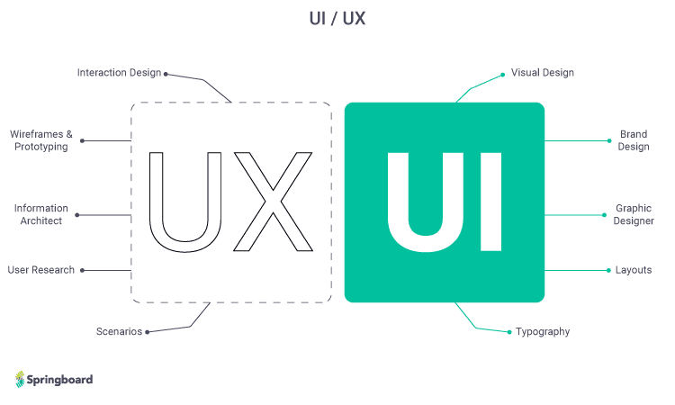
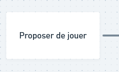
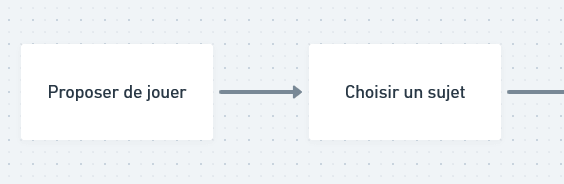
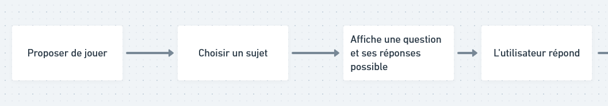
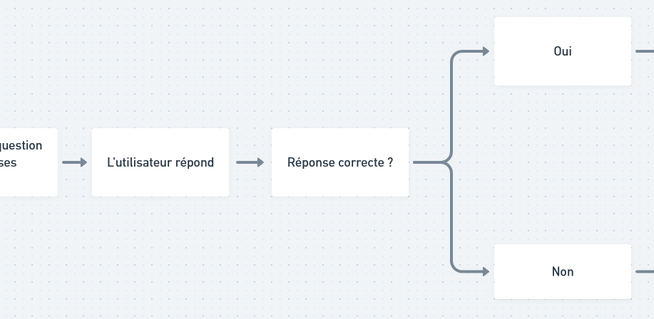
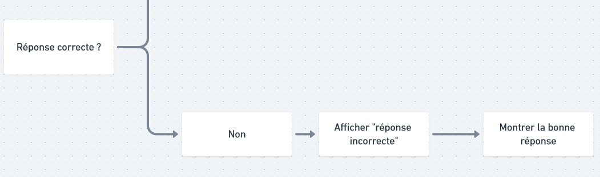
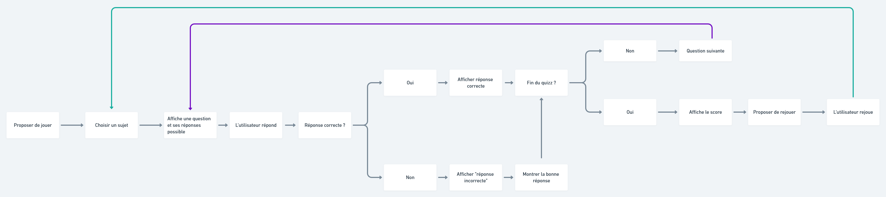
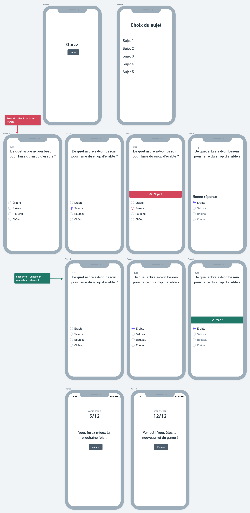

# Interface Homme-machine
## Qu'est-ce qu'une interface homme machine ?
L'arrivée des machines puis des ordinateurs nous a permis de produire plus, plus vite et avec plus de confort. Mais pour que la promesse puisse être tenu, il faut que la communication entre l'humain et sa machine soit efficace. Et c'est là qu'entre en scène les interfaces.

## Le rôle d'une interface
Une interface, c'est le moyen qui nous permet de communiquer avec une machine, un appareil, un ordinateur, ect. C'est un échange de besoins et de réponses.

### Exemple: une app de traduction
Supposons que je veuille savoir comment dit-on «écran» en anglais. De mon point de vue, je vais prendre mon PC ou mon smartphone et à un moment, je vais devoir entrer le mot «écran» quelque part et demander la langue dans laquelle je veux qu'il soit traduit.
Du point de vue de la machine, elle n'a rien à faire jusqu'à ce que vous veniez lui demander une traduction. Et pour pouvoir vous répondre, elle attend de vous :
- Que vous lui dites ce que vous voulez traduire
- La langue d'origine
- La langue dans laquelle vous souhaitez la traduction

Sans interface, la machine ne peut rien pour vous et tout ce qu'il vous reste à faire, c'est d'aller dépoussierrer un bon vieux [Robert](https://www.lerobert.com/dictionnaires/anglais/langue/dictionnaire-le-robert-collins-mini-plus-anglais-9782321011422.html) pour obtenir la traduction du mot que vous vouliez. ¯\_(ツ)_/¯

## Les disciplines de l'IHM
Pour qu'une interface soit efficace, elle doit prendre en compte les caratérisiques humaines telque la vue, le langage, les émotions, la capacité d'agir, de réflechirn d'apprendre, ect. Elle doit prendre aussi en compte nos défauts comme un handicap ou notre irritabilité par exemple.
Pour produire une bonne interface, deux disciplines ont chacunes un job attitrés.

Source de l'image : [Springboard](https://www.springboard.com/library/ui-ux-design/how-to-become/)
### L'expérience utilisateur (UX)
Le role de l'UX (User Expérience en anglais), c'est comment permettre à une personne d'éxecuter une tâche de la manière la plus satisfaisante possible.
Pour ça, l'interface (*) a besoin d'être simple, fluide et plaisante sur le plan émotionnel.
* Notez que l'UX est partout autour de nous mais par soucis de simplicité, je suis resté sur "interface".

### Le design d'interface utilisateur (UI)
À travers un accord de mise en page, de typographie et de couleurs, l'UI designer doit formaliser le travail de l'UX designer en produisant une interface compréhensible et plaisante sur le plan visuel.

Dans ce module, on va s'occuper principalement de l'expérience utilisateur.

## Comment construire une expérience utilisateur ?
Il existe évidemment beaucoup de possibilité mais ici aussi, par soucis de simplicité, on va se concentrer sur les flowcharts et les wireframes.

### Flowchart
Les flowcharts (ou user flow) vont vous servir à créer les chemins possibles pour votre interface. À partir de ça, vous pourrez visualiser plus facilement les éléments (boutons, formulaires, ect) et les pages qui auront besoin d'être conçus.

### Wireframes
Un wireframe est la première pierre vers ce qui ressemble à une interface utilisable. Il s'agit d'essayer de placer et répartir les éléments dans l'espace pour pouvoir tester si l'utilisateur peut effectuer la tâche qu'il veut faire de la meilleure des manières

## Construisons une interface de quizz
Dans ce contexte, une personne souhaite tester ses connaissances sur un sujet. Donc de son point de vue, il s'attend à ce qu'il soit questionné et qu'à la fin, on lui donne son score.
Du point de vue de la machine, elle a besoin de savoir sur quel sujet l'utilisateur veut être tester pour aller chercher le bon quizz et à la fin, la machine doit savoir si vous voulez rejouer pour recommencer le processus.

### Voilà tante Flow !
Commençons par le flowchart. Le point d'entré, c'est quelqu'un qui veux jouer. Donc l'interface doit proposer de jouer.

L'étape suivante, c'est le choix du sujet.

Maintenant, le jeux peut commencer. L'interface vous propose une question et vous devez y répondre.

Et là, on atteind un point de rupture parce qu'il y a deux scénarios : soit l'utilisateur a répondu correctement, soit il a fait une erreur. Donc l'interface se divise provisoirement (ou non) selon votre cas.

Si l'utilisateur a mal répondu, vous devez faire un choix de conception. Est-ce qu'on affiche directement la réponse et on passe à la question suivante ou est-ce que l'interface reste bloqué jusqu'à ce qu'il réponde correctement ? Ici, j'ai choisi d'afficher la réponse.

#### Les boucles et connecteurs unificateurs
Si l'utilateur a bien répondu, l'interface va passer à la question suivante. L'utilisateur devra répondre et ainsi de suite. Donc ici, on a une étape qui va se répéter jusqu'à la fin du jeu.
Au lieu de continuer à refaire indéfiniment l'étape sur le flowchart, on va ajouter un connecteur qui rejoind l'étape initial. Donc voici le résultat final du flowchart

[Image en taille réélle](06.png)

### Wireframe du quizz
En observant le flowchart, je constate que je vais devoir concevoir :
- Un écran d'accueil
- La selection du sujet
- Un écran question/réponses
- Je vais devoir réfléchir à la façon dont l'interface va répondre à une bonne ou une mauvaise réponse
- Un écran de fin avec le score et la proposition de rejouer

#### Résultat

[Image en taille réélle](wireframe.png)
En faisant le wireframe, on s'apperçois que l'écran d'accueil peut être supprimé. Si j'ouvre l'application ou que je me rends sur la page pour passer un quizz, ça marque déjà mon envie de jouer non ? Donc pourquoi ne pas me proposer directement le choix du sujet au lieu de me proposer de jouer ?

### Enrichir l'UX
L'interface est fonctionnelle et utilisable donc FIN DU GAME ? Oui et non. Tout dépend du profil des utilisateurs finals, du travail commandé et de votre capacité à vouloir aller plus loin. Ici, si l'application est destiné à un publique jeune, on peut très bien imaginer insérer des gifs animés, bien travaillé les animations et bien choisir la formulation des messages. Dans mon exemple, «Yeah» et «Nope» sont forcèment des formulations qu'on évitera pour un publique plus formel.

Vous en savez maintenant assez pour aborder ce module avec sérénité.
